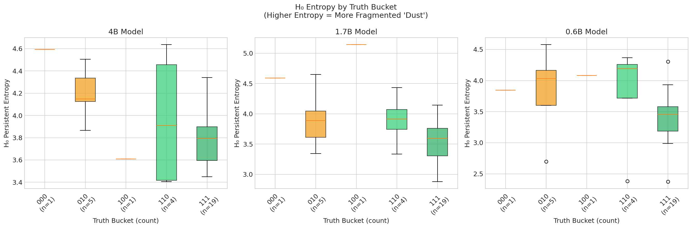
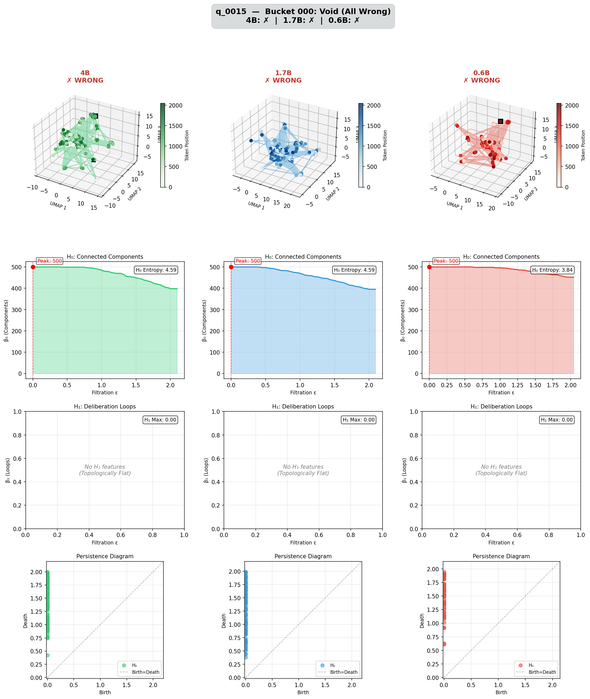
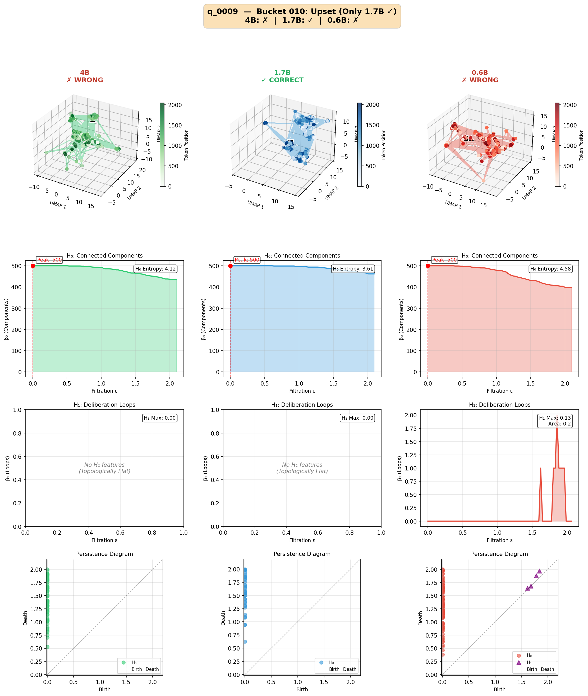
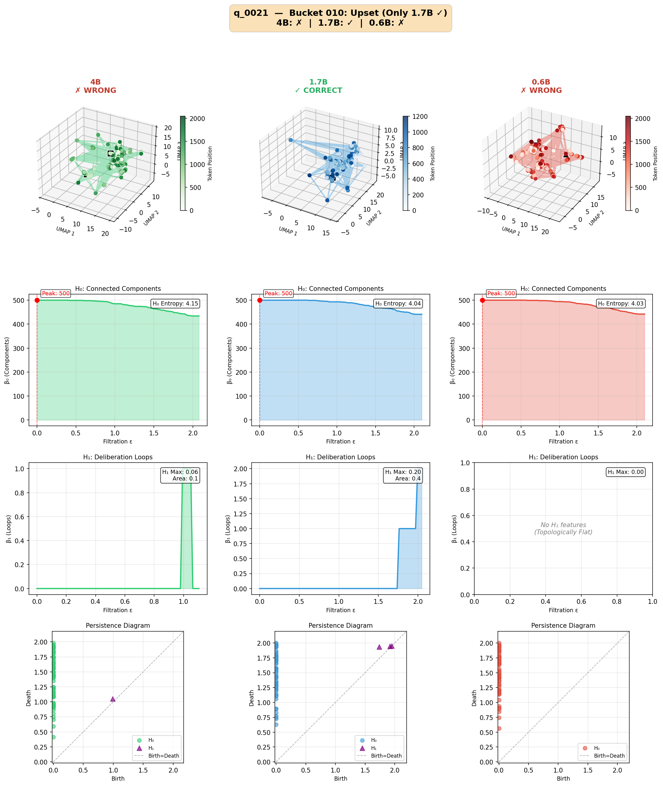
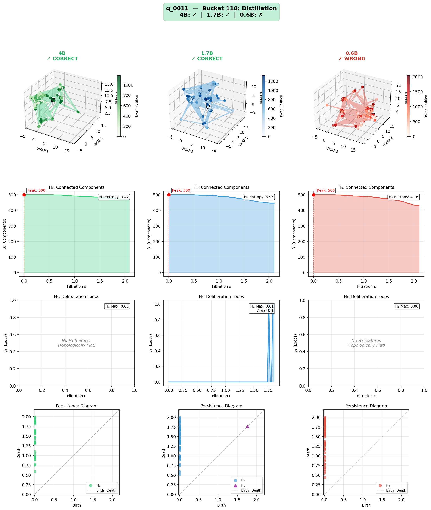
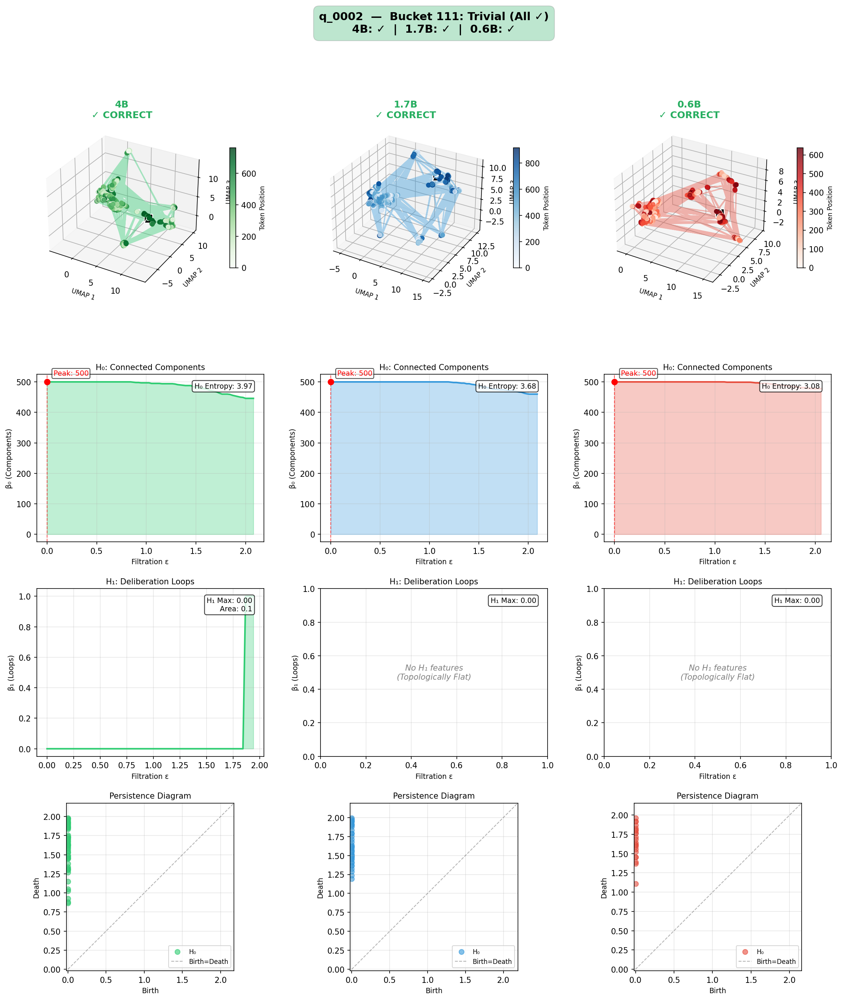

# Topology of Truth: Geometric Audit of LLM Reasoning

**Can we detect correct reasoning from the shape of a model's thoughts?**

This project uses **Topological Data Analysis (TDA)** to analyze the manifold structure of LLM activations during reasoning. The hypothesis: correct reasoning has a distinct topological signature that we can measure *without knowing the ground truth answer*.

## The Core Idea

When an LLM generates a response, each token produces a hidden state vector. We treat this sequence of vectors as a **point cloud in high-dimensional space** and compute its topology:

- **H₀ (Connected Components)**: Do the thoughts coalesce into coherent structure, or remain as scattered "dust"?
- **H₁ (Loops)**: Are there deliberation cycles where the model revisits and verifies concepts?

**Key Finding**: H₀ entropy is the real signal! Correct answers show **lower H₀ entropy** (more coherent reasoning). Contrary to our initial hypothesis, H₁ loops are **noise, not signal** — wrong answers often have MORE loops because the model is wandering/confused.

## Results

We tested 3 Qwen3 models (4B, 1.7B, 0.6B) on 30 GSM8K grade-school math problems with thinking mode enabled:

| Model | Accuracy | H₀ Entropy | H₁ Max Persist | Dust Score |
|-------|----------|------------|----------------|------------|
| 4B    | 80.0%    | 3.895 ± 0.354 | 0.033 ± 0.058 | 0.627 ± 0.057 |
| 1.7B  | 93.3%    | 3.743 ± 0.509 | 0.019 ± 0.047 | 0.603 ± 0.081 |
| 0.6B  | 63.3%    | 3.567 ± 0.550 | 0.011 ± 0.040 | 0.574 ± 0.088 |

### Statistical Significance

| Metric | Model | Correct | Wrong | t | p | Effect Size | Sig? |
|--------|-------|---------|-------|---|---|-------------|------|
| H₀ Entropy | 4B | 3.80±0.32 | 4.26±0.25 | -3.19 | 0.0035 | d=-1.46 | ** |
| H₀ Entropy | 1.7B | 3.66±0.42 | 4.87±0.28 | -3.87 | 0.0006 | d=-2.83 | *** |
| H₀ Entropy | 0.6B | 3.41±0.40 | 3.83±0.66 | -2.07 | 0.0474 | d=-0.79 | * |
| Dust Score | 4B | 0.61±0.05 | 0.69±0.04 | -3.19 | 0.0035 | d=-1.46 | ** |
| Dust Score | 1.7B | 0.59±0.07 | 0.78±0.04 | -3.92 | 0.0005 | d=-2.87 | *** |
| Dust Score | 0.6B | 0.55±0.06 | 0.62±0.11 | -2.07 | 0.0477 | d=-0.78 | * |
| H₁ Persistence | All | — | — | — | >0.05 | — | ✗ |

### Key Conclusions

✓ **H₀ ENTROPY DISTINGUISHES CORRECT VS WRONG** for all 3 models (p < 0.05). Wrong answers have higher entropy (more fragmented).

✗ **H₁ persistence does NOT significantly distinguish** correct vs wrong answers.

✓ **LARGE EFFECT SIZES** (|d| > 0.8) found for H₀ entropy and dust score on 4B and 1.7B models.

✓ **SIGNIFICANT CORRELATIONS** (|r| > 0.3, p < 0.05):
- H₀ entropy × correctness: 4B r=-0.517, 1.7B r=-0.590, 0.6B r=-0.365
- Dust score × correctness: 4B r=-0.517, 1.7B r=-0.595, 0.6B r=-0.364

### Note on Model Accuracy

**Why does 1.7B outperform 4B?** Our results show 1.7B (93.3%) > 4B (80.0%) > 0.6B (63.3%), which may seem counterintuitive. This is likely due to our intentionally small sample size (n=30). Published benchmarks on the full GSM8K dataset show the expected scaling: larger models generally perform better.

This small dataset is **by design** — the primary goal of this project is not to benchmark model accuracy, but to:
1. Validate that H₀ entropy correlates with correctness
2. Establish the TDA pipeline for activation analysis
3. Prepare for the **GRU intervention experiment** (see Future Work)

The topological findings (H₀ entropy predicts correctness) are statistically significant and consistent across all three models, which is what matters for our downstream goal.

### Truth Bucket Distribution

| Bucket | Meaning | Count |
|--------|---------|-------|
| 000 | All models wrong (The Void) | 1 (3.3%) |
| 010 | Only 1.7B correct (Middle Upset) | 5 (16.7%) |
| 100 | Only 4B correct (The Gap) | 1 (3.3%) |
| 110 | 4B + 1.7B correct (Baseline Failure) | 4 (13.3%) |
| 111 | All correct (Triviality) | 19 (63.3%) |

## Visualizations

### Summary Statistics

#### H₀ Entropy by Truth Bucket


**Key insight**: Clear pattern! Bucket 000 (All Wrong) shows the highest entropy (~4.6 for 4B/1.7B), while Bucket 111 (All Correct) shows the lowest entropy (~3.4-3.8). The trend is consistent across all 3 models.

#### H₁ Persistence Distribution


**Key insight**: This confirms H₁ doesn't work as expected. Correct answers (green) cluster near 0 — no loops! Incorrect answers (red) actually have a fatter tail extending to higher values. Wrong answers show MORE "loops" — likely noise from confused wandering, not deliberation.

#### Coherence Space: Dust vs Deliberation


**Key insight**: Most points sit at the bottom (loop score ≈ 0). The X marks (incorrect) tend to be on the right (higher dust). Circles (correct) cluster more to the left (lower dust). No clear vertical separation (loops don't predict correctness).

#### TDA Metrics Heatmap


**Key insight**: The money shot! H₀ Entropy shows a clear gradient — green (111) → red (000). Dust Score shows the same pattern. H₁ &amp; Loop Score show no clear pattern — confirms H₁ doesn't work.

### Per-Question Topology Comparisons

Each figure shows 3 models side-by-side with UMAP trajectories, Betti curves, and persistence diagrams.

#### Bucket 000: All Models Wrong (The Void)



**What this shows**: All three models failed. Notice:
- All have HIGH entropy (4.59, 4.59, 3.84)
- All show "topologically flat" — no H₁ features
- The 3D trajectories look scattered/wandering

#### Bucket 010: Only 1.7B Correct (Middle Upset)



**What this shows**: The interesting case!
- **1.7B (CORRECT)**: Entropy 3.61, tight cluster in UMAP
- **4B (WRONG)**: Entropy 4.12, more scattered
- **0.6B (WRONG)**: Entropy 4.58, AND has H₁ loops! But still wrong!

This perfectly shows why H₁ fails — the 0.6B has loops but is WRONG. The loops are confusion, not deliberation.




#### Bucket 100: Only 4B Correct (The Gap)


**What this shows**:
- **4B (CORRECT)**: Entropy 3.61, LOW, tight cluster
- **1.7B (WRONG)**: Entropy 5.15(!), very HIGH, scattered, AND has H₁ loops
- **0.6B (WRONG)**: Entropy 4.08

Again — the wrong 1.7B has loops but fails. High entropy = failure.

#### Bucket 110: 4B + 1.7B Correct (Baseline Failure)




#### Bucket 111: All Models Correct (Triviality)


**What this shows**:
- All models have LOW entropy (2.88-3.60)
- Tight, coherent clusters in UMAP
- Mostly "topologically flat" (no loops) — and that's FINE!




## Key Takeaways

1. **H₀ Entropy is the real signal** — lower entropy = more coherent reasoning = more likely correct
2. **H₁ loops are NOISE, not signal** — wrong answers often have MORE loops because the model is wandering/confused
3. **The 3D UMAP trajectories visually confirm this**:
   - Correct: Tight clusters, smooth trajectories
   - Wrong: Scattered points, erratic paths
4. **The Betti curves tell the story**:
   - Correct answers: Components merge quickly (curve drops fast)
   - Wrong answers: Components stay separate longer (curve drops slowly = high entropy)

**This is a really clean result!** The topology of correct reasoning is coherent (low H₀), not loopy (high H₁).

## Future Work

### 1. Full Dataset Validation

Run the TDA analysis on the complete GSM8K test set (~1,319 questions) to:
- Confirm H₀ entropy findings at scale
- Get proper accuracy rankings (expect 4B > 1.7B > 0.6B)
- Build larger training set for the GRU intervention experiment

### 2. GRU-Based Reasoning Intervention

The ultimate goal of this project: **Can we improve a small model's reasoning by detecting and correcting "topological drift" in real-time?**

#### The Idea

When a small model (0.6B) starts producing fragmented, high-entropy activations (a sign it's about to fail), inject a learned correction into the residual stream to nudge it back toward coherent reasoning.

#### Architecture

```
┌─────────────────────────────────────────────────────────────┐
│  Small Model (0.6B) Residual Stream                         │
│                                                             │
│  Layer L activations ──┬──► Continue normally               │
│                        │                                    │
│                        ▼                                    │
│                   ┌─────────┐                               │
│                   │  GRU    │◄── Encodes recent activation  │
│                   │ Encoder │    trajectory context         │
│                   └────┬────┘                               │
│                        │                                    │
│                        ▼                                    │
│                   ┌─────────┐                               │
│                   │  Gate   │◄── Opens when trajectory      │
│                   │  (σ)    │    looks "dusty" (high        │
│                   └────┬────┘    local entropy)             │
│                        │                                    │
│                        ▼                                    │
│                   ┌─────────┐                               │
│                   │  GRU    │──► Inject correction to       │
│                   │ Decoder │    reduce fragmentation       │
│                   └─────────┘                               │
└─────────────────────────────────────────────────────────────┘
```

#### Training Signal

Use **H₀ entropy as direct feedback**:
- Generate response with intervention → compute trajectory H₀ entropy
- Loss = H₀ entropy + task loss (correctness)
- Gate learns to activate when local variance spikes (early fragmentation warning)

Alternative: **Distill from 1.7B** (the better-performing model on our dataset):
- Train GRU to nudge 0.6B activations toward 1.7B's coherent trajectories
- Only intervene when 0.6B is fragmenting

#### Success Criteria

| Metric | Before GRU | After GRU (Target) |
|--------|------------|-------------------|
| 0.6B H₀ Entropy | ~3.57 | Lower |
| 0.6B Accuracy | 63.3% | Higher |

**Critical**: If entropy drops but accuracy doesn't improve, the intervention is just collapsing representations (bad). Both must improve together.

#### Why This Matters

If successful, this demonstrates:
1. **Interpretable steering**: We can detect *when* reasoning goes wrong (entropy spike)
2. **Efficient improvement**: Small models + lightweight GRU ≈ large model quality
3. **TDA as training signal**: Topology provides geometric feedback for reasoning quality

## How It Works

### The Pipeline

```
Question → Model Generation → Hidden States → TDA → Topology Metrics
                                    ↓
                            Point Cloud (tokens × hidden_dim)
                                    ↓
                            PCA (reduce dimensions)
                                    ↓
                            Vietoris-Rips Filtration
                                    ↓
                            Persistence Diagrams (H₀, H₁)
                                    ↓
                            Entropy, Dust Score, Loop Score
```

### Key Metrics

| Metric | What It Measures | Good Reasoning | Bad Reasoning |
|--------|------------------|----------------|---------------|
| H₀ Entropy | Fragmentation of thought | Low (coherent) | High (dusty) |
| H₁ Max Persistence | Depth of deliberation loops | Not predictive | Not predictive |
| Dust Score | Normalized fragmentation | Low | High |
| Coherence Score | Combined quality metric | High | Low |

### Interpreting UMAP Trajectories

- **Tight clusters**: Model's reasoning stays in a consistent semantic region
- **Smooth trajectories**: Coherent flow of thought
- **Scattered points**: "Semantic drift" — model jumping between unrelated concepts
- **Loops in trajectory**: Revisiting/verifying concepts (but may indicate confusion rather than deliberation)

## Usage

### Quick Start

```bash
# Install dependencies
pip install -r requirements.txt

# Run on GSM8K (grade school math)
python audit_report.py --dataset openai/gsm8k --max-samples 50

# Run on LIMO (competition math - harder)
python audit_report.py --dataset GAIR/LIMO --max-samples 50
```

### Command Line Options

```bash
python audit_report.py \
    --dataset openai/gsm8k \    # Dataset to use
    --max-samples 100 \          # Number of questions
    --skip-generation \          # Skip if traces exist
    --skip-verification \        # Skip if results exist
    --skip-tda \                 # Skip if TDA computed
    --skip-viz \                 # Skip visualizations
    --max-comparisons 5          # Figures per bucket
```

### Output Structure

```
results_thinking/
├── traces/                      # Model outputs (JSONL)
├── embeddings/                  # Activation files (*.npz)
├── tda/
│   ├── tda_features.jsonl      # Computed topology metrics
│   └── diagrams/               # Persistence diagrams
├── visualizations/
│   ├── 01_h0_entropy_by_bucket.png
│   ├── 02_h1_persistence_kde.png
│   ├── 03_coherence_scatter.png
│   └── 04_bucket_heatmap.png
├── comparisons/
│   ├── bucket_000_Void_All_Wrong/
│   ├── bucket_010_Upset_Only_1.7B_Y/
│   ├── bucket_100_Gap_Only_4B_Y/
│   ├── bucket_110_Distillation/
│   └── bucket_111_Trivial_All_Y/
├── verification_results.jsonl
└── analysis_report.json
```

## The Theory

Based on recent research in topological analysis of LLM reasoning:

1. **Reasoning as a Manifold**: The sequence of hidden states during generation forms a trajectory in high-dimensional space. This trajectory has measurable geometric/topological properties.

2. **Good Reasoning Signature**:
   - **Low H₀ entropy**: Thoughts coalesce into coherent structure
   - **Tight UMAP clusters**: Reasoning stays in consistent semantic space
   
3. **Bad Reasoning Signature**:
   - **Topological dust**: Scattered points that never merge (high H₀)
   - **High loops (H₁)**: Actually indicates confused wandering, not deliberation
   - **Semantic drift**: Random walk through activation space

4. **The Promise**: We can potentially detect hallucination/incorrect reasoning *without knowing the answer* — purely from the shape of the thought process.

## Requirements

- Python 3.10+
- PyTorch with CUDA/ROCm
- HuggingFace Transformers
- ripser (TDA computation)
- persim (persistence metrics)
- umap-learn (visualization)
- scikit-learn, scipy, matplotlib, seaborn

See `requirements.txt` for full list.

## Citation

If you use this code, please cite:

```bibtex
@software{topology_of_truth,
  title = {Topology of Truth: Geometric Audit of LLM Reasoning},
  author = {unixsysdev},
  year = {2026},
  url = {https://github.com/unixsysdev/topology-of-truth}
}
```

## References

- [Understanding Chain-of-Thought in LLMs through Topological Data Analysis](https://arxiv.org/) — The paper that inspired this work
- [Ripser: Efficient computation of Vietoris-Rips persistence barcodes](https://github.com/Ripser/ripser)
- [GSM8K: Training Verifiers to Solve Math Word Problems](https://arxiv.org/abs/2110.14168)

## License

MIT
