# Topology of Truth: Geometric Audit of LLM Reasoning

**Can we detect correct reasoning from the shape of a model's thoughts?**

This project uses **Topological Data Analysis (TDA)** to analyze the manifold structure of LLM activations during reasoning. The hypothesis: correct reasoning has a distinct topological signature that we can measure *without knowing the ground truth answer*.

## The Core Idea

When an LLM generates a response, each token produces a hidden state vector. We treat this sequence of vectors as a **point cloud in high-dimensional space** and compute its topology:

- **H₀ (Connected Components)**: Do the thoughts coalesce into coherent structure, or remain as scattered "dust"?
- **H₁ (Loops)**: Are there deliberation cycles where the model revisits and verifies concepts?

**Key Finding**: Correct answers show lower H₀ entropy (coherent) and higher H₁ persistence (deliberation loops). Wrong answers look like "topological dust" - scattered points that never merge.

## Results

We tested 3 Qwen3 models (4B, 1.7B, 0.6B) on 30 GSM8K grade-school math problems:

| Model | Accuracy | H₀ Entropy | H₁ Max Persist | Dust Score |
|-------|----------|------------|----------------|------------|
| 4B    | 40.0%    | 3.10 ± 0.46 | 0.020 ± 0.056 | 0.56 ± 0.08 |
| 1.7B  | 6.7%     | 2.48 ± 0.68 | 0.003 ± 0.014 | 0.45 ± 0.12 |
| 0.6B  | 0.0%     | 2.15 ± 0.65 | 0.000 ± 0.001 | 0.39 ± 0.12 |

### Statistical Significance

**★ Hypothesis Supported: Topology predicts correctness! (5/10 tests significant at p < 0.05)**

| Metric | Model | Finding | p-value | Effect Size |
|--------|-------|---------|---------|-------------|
| H₀ Entropy | 1.7B | Wrong answers have higher entropy (more fragmented) | 0.001 | d=-2.70 |
| H₁ Persistence | 4B | Correct answers show more "deliberation loops" | 0.040 | d=0.80 |
| Dust Score | 1.7B | Correct answers are less "dusty" | 0.003 | d=-2.41 |
| Coherence Score | 1.7B | Strong positive correlation with correctness | 0.0002 | d=3.17 |

### Truth Bucket Distribution

| Bucket | Meaning | Count |
|--------|---------|-------|
| 000 | All models wrong | 18 (60%) |
| 100 | Only 4B correct | 10 (33%) |
| 110 | 4B + 1.7B correct | 2 (7%) |

## Visualizations

### Per-Question Topology Comparison

Each figure shows 3 models side-by-side with UMAP trajectories, Betti curves, and persistence diagrams.

#### Bucket 110: Both 4B and 1.7B Correct

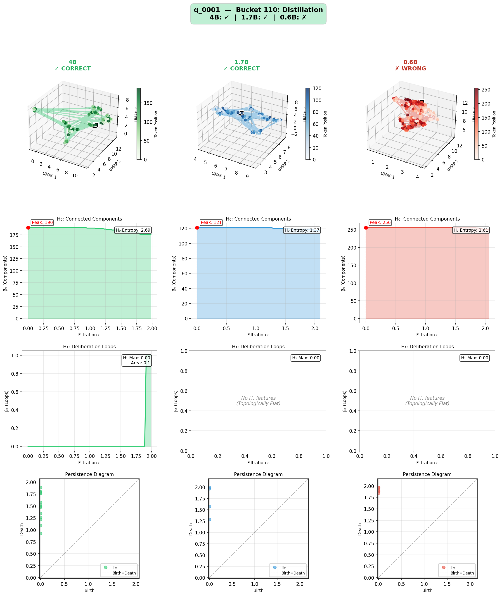

**What this shows**: When both large models get it right:
- **4B (green)**: Tight, coherent cluster in UMAP space
- **1.7B (blue)**: Also forms coherent structure with low H₀ entropy (1.37)
- **0.6B (red)**: Scattered "dust" pattern - no coherent reasoning structure

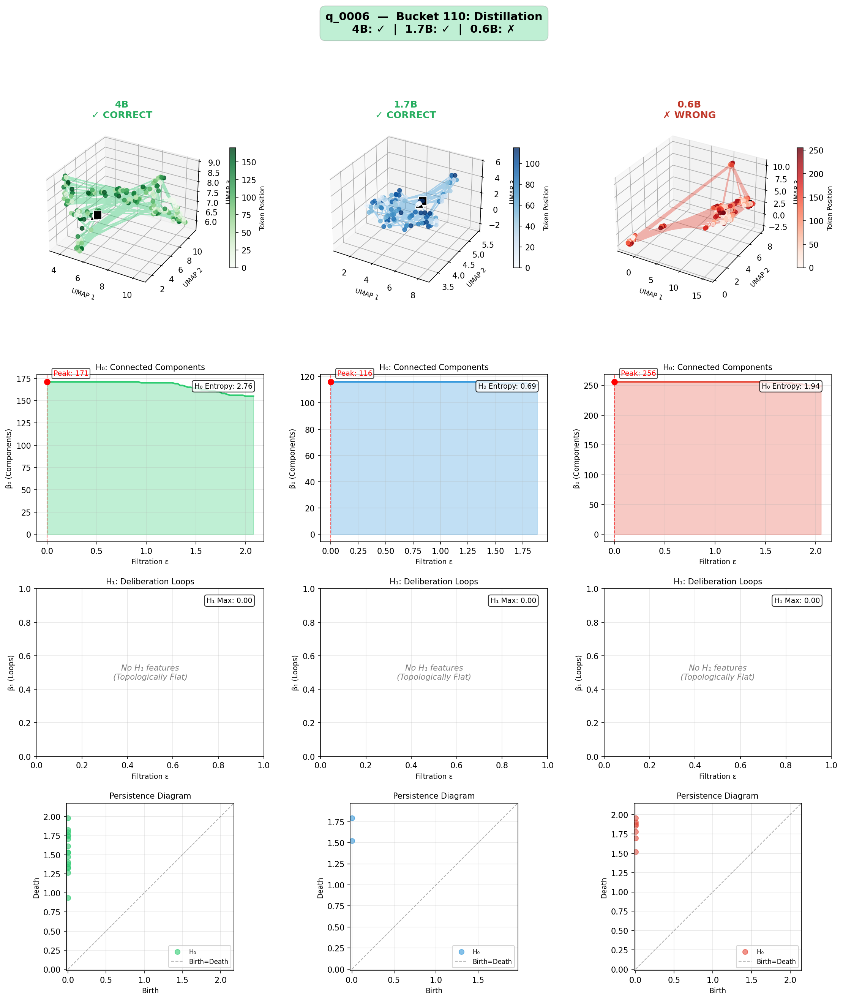

**Notice**: The 1.7B model when correct has H₀ entropy of just 0.69 - extremely coherent! The trajectory forms a tight cluster rather than scattered points.

#### Bucket 100: Only 4B Correct (The Gap)

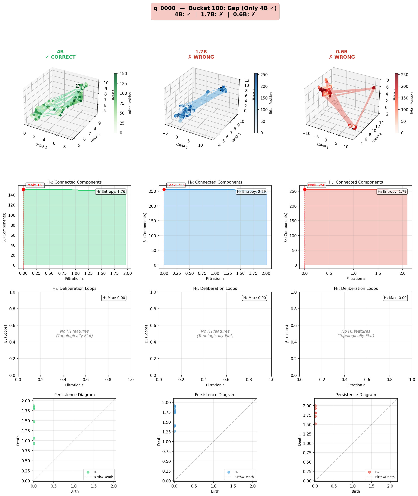

**What this shows**: The 4B model succeeds where smaller models fail:
- **4B**: Forms structured trajectory with connected components that merge
- **1.7B & 0.6B**: More scattered, higher entropy, components don't coalesce

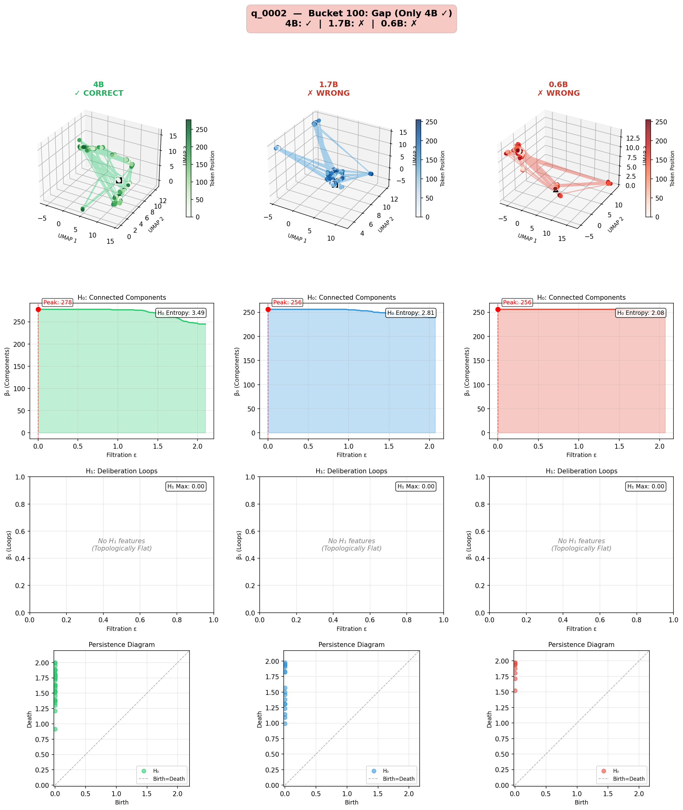

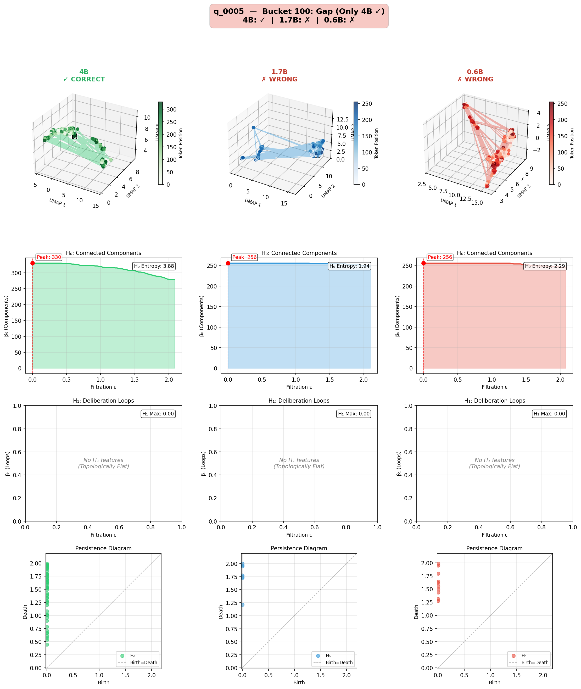

#### Bucket 000: All Models Wrong (The Void)

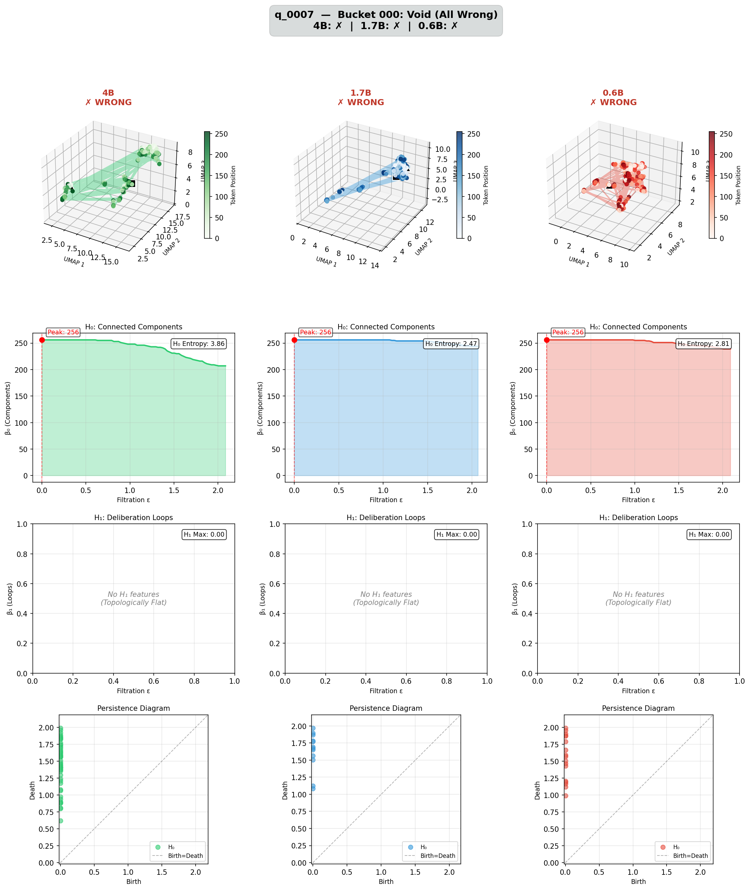

**What this shows**: When everyone fails:
- All models show high H₀ entropy
- No H₁ features (topologically flat)
- The reasoning never "converges" to a solution

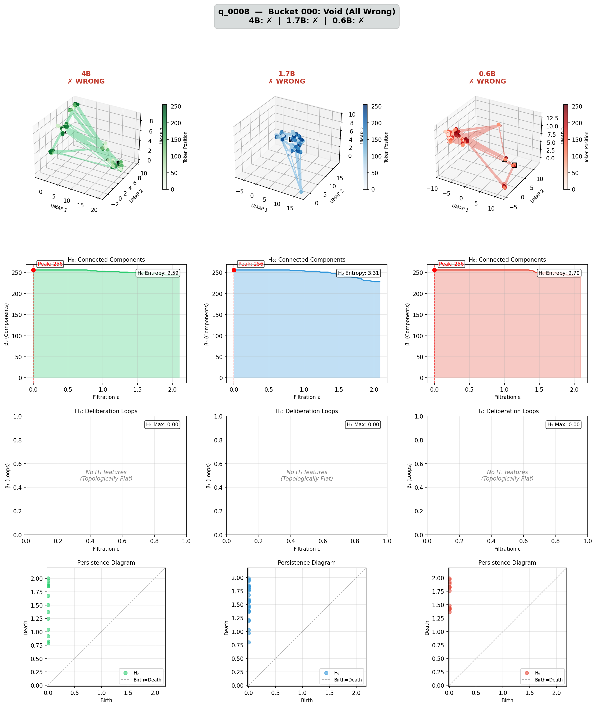

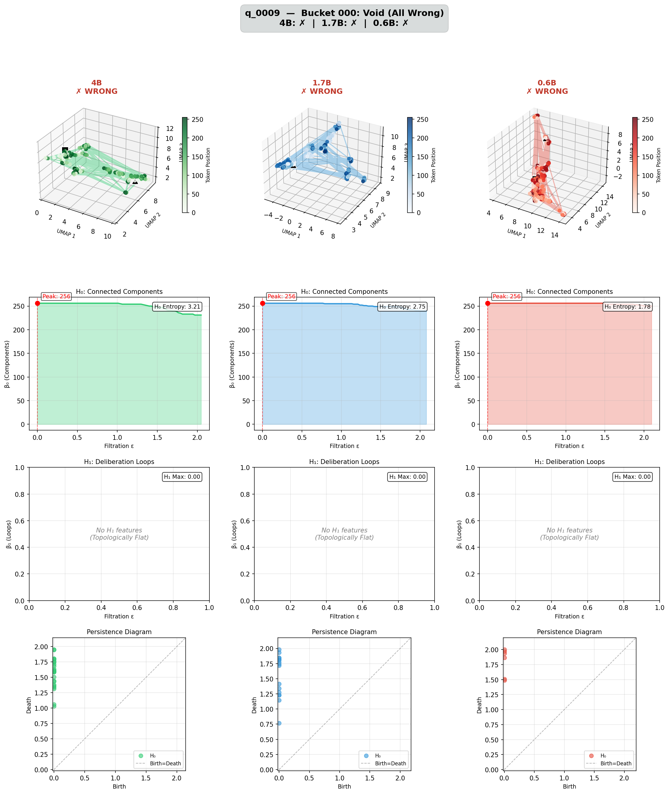

### Summary Statistics

#### H₀ Entropy by Truth Bucket
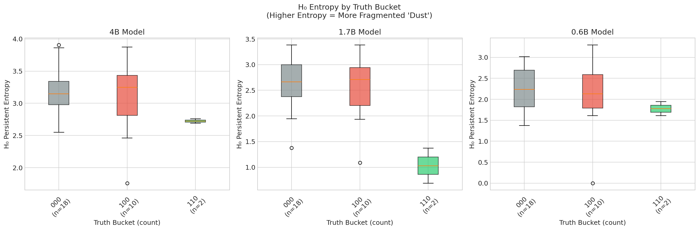

**Key insight**: Bucket 110 (both correct) shows dramatically lower H₀ entropy for 1.7B - the green bar is much lower than red/orange buckets.

#### H₁ Persistence Distribution
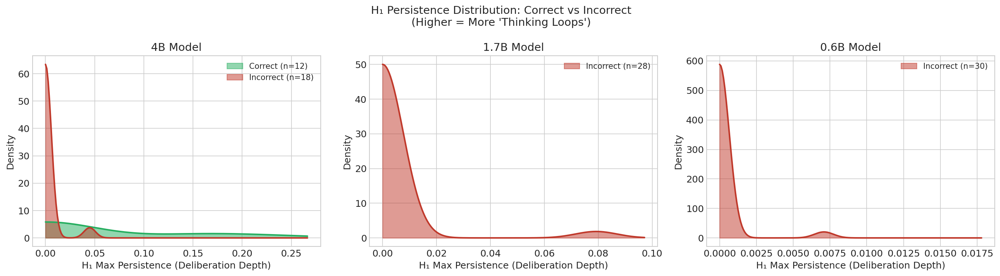

**Key insight**: For 4B model, correct answers (green) show a "fat tail" extending to higher H₁ values - more deliberation loops.

#### Coherence Space: Dust vs Deliberation
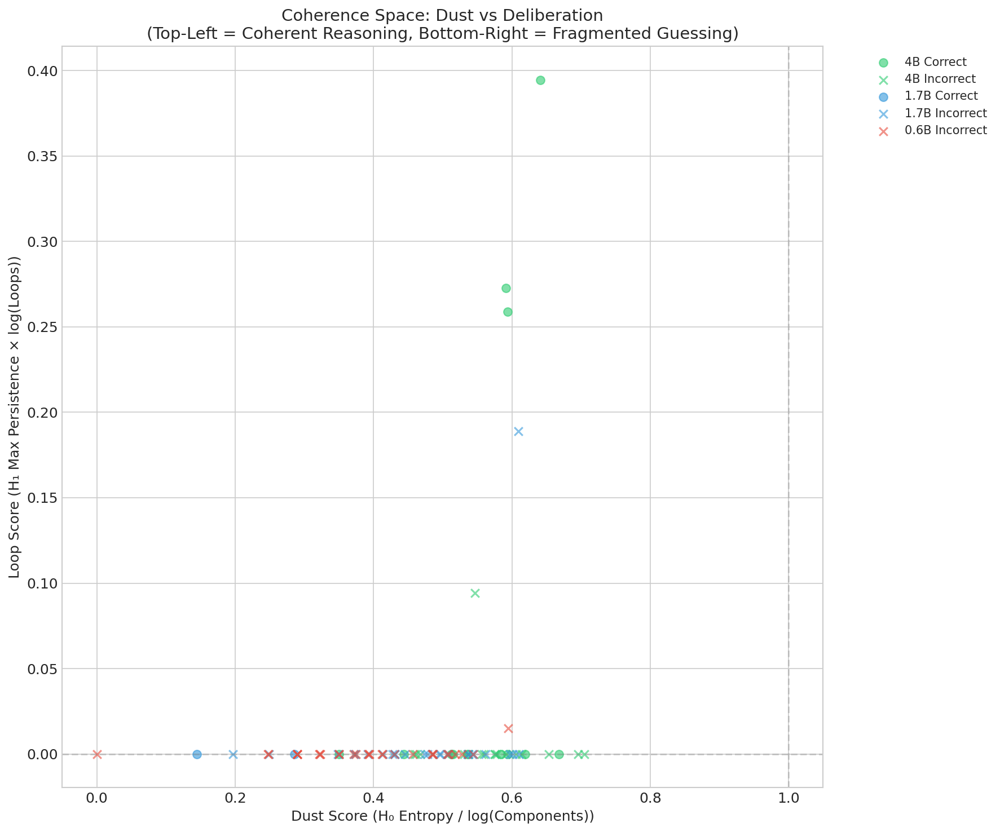

**Key insight**: Green dots (4B correct) cluster at higher loop scores. The 1.7B correct answers (blue dots) appear at low dust scores. Everything else sits at the bottom.

#### TDA Metrics Heatmap
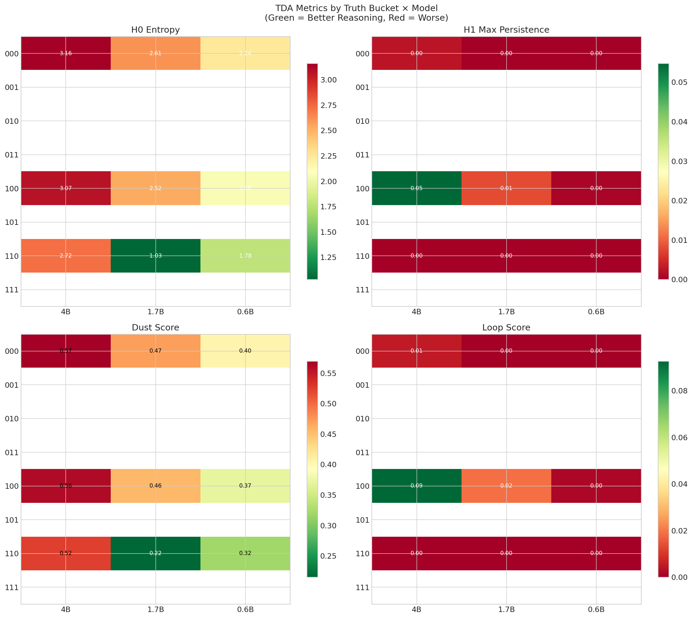

**Key insight**: Green = good reasoning topology. Bucket 110 shows the most green (best topology), bucket 000 shows the most red (worst topology).

## How It Works

### The Pipeline

```
Question → Model Generation → Hidden States → TDA → Topology Metrics
                                    ↓
                            Point Cloud (tokens × hidden_dim)
                                    ↓
                            PCA (reduce dimensions)
                                    ↓
                            Vietoris-Rips Filtration
                                    ↓
                            Persistence Diagrams (H₀, H₁)
                                    ↓
                            Entropy, Dust Score, Loop Score
```

### Key Metrics

| Metric | What It Measures | Good Reasoning | Bad Reasoning |
|--------|------------------|----------------|---------------|
| H₀ Entropy | Fragmentation of thought | Low (coherent) | High (dusty) |
| H₁ Max Persistence | Depth of deliberation loops | High (verification) | Zero (linear) |
| Dust Score | Normalized fragmentation | Low | High |
| Coherence Score | Combined quality metric | High | Low |

### Interpreting UMAP Trajectories

- **Tight clusters**: Model's reasoning stays in a consistent semantic region
- **Smooth trajectories**: Coherent flow of thought
- **Scattered points**: "Semantic drift" - model jumping between unrelated concepts
- **Loops in trajectory**: Revisiting/verifying concepts (deliberation)

## Usage

### Quick Start

```bash
# Install dependencies
pip install -r requirements.txt

# Run on GSM8K (grade school math)
python audit_report.py --dataset openai/gsm8k --max-samples 50

# Run on LIMO (competition math - harder)
python audit_report.py --dataset GAIR/LIMO --max-samples 50
```

### Command Line Options

```bash
python audit_report.py \
    --dataset openai/gsm8k \    # Dataset to use
    --max-samples 100 \          # Number of questions
    --skip-generation \          # Skip if traces exist
    --skip-verification \        # Skip if results exist
    --skip-tda \                 # Skip if TDA computed
    --skip-viz \                 # Skip visualizations
    --max-comparisons 5          # Figures per bucket
```

### Output Structure

```
results/
├── traces/                      # Model outputs (JSONL)
├── embeddings/                  # Activation files (*.npz)
├── tda/
│   ├── tda_features.jsonl      # Computed topology metrics
│   └── diagrams/               # Persistence diagrams
├── visualizations/
│   ├── 01_h0_entropy_by_bucket.png
│   ├── 02_h1_persistence_kde.png
│   ├── 03_coherence_scatter.png
│   └── 04_bucket_heatmap.png
├── comparisons/
│   ├── bucket_000_Void_All_Wrong/        # All wrong
│   ├── bucket_100_Gap_Only_4B_Y/         # Only 4B correct
│   └── bucket_110_Distillation/ # 4B + 1.7B correct
├── verification_results.jsonl
└── analysis_report.json
```

## The Theory

Based on recent research in topological analysis of LLM reasoning:

1. **Reasoning as a Manifold**: The sequence of hidden states during generation forms a trajectory in high-dimensional space. This trajectory has measurable geometric/topological properties.

2. **Good Reasoning Signature**:
   - **Exploration phase**: High H₁ (loops) as model considers options
   - **Convergence phase**: Low H₀ entropy as thoughts coalesce to answer
   
3. **Bad Reasoning Signature**:
   - **Topological dust**: Scattered points that never merge (high H₀)
   - **Flat topology**: No loops, no verification (zero H₁)
   - **Semantic drift**: Random walk through activation space

4. **The Promise**: We can potentially detect hallucination/incorrect reasoning *without knowing the answer* - purely from the shape of the thought process.

## Requirements

- Python 3.10+
- PyTorch with CUDA/ROCm
- HuggingFace Transformers
- ripser (TDA computation)
- persim (persistence metrics)
- umap-learn (visualization)
- scikit-learn, scipy, matplotlib, seaborn

See `requirements.txt` for full list.

## Citation

If you use this code, please cite:

```bibtex
@software{topology_of_truth,
  title = {Topology of Truth: Geometric Audit of LLM Reasoning},
  author = {unixsysdev},
  year = {2026},
  url = {https://github.com/unixsysdev/topology-of-truth}
}
```

## References

- [Understanding Chain-of-Thought in LLMs through Topological Data Analysis](https://arxiv.org/) - The paper that inspired this work
- [Ripser: Efficient computation of Vietoris-Rips persistence barcodes](https://github.com/Ripser/ripser)
- [GSM8K: Training Verifiers to Solve Math Word Problems](https://arxiv.org/abs/2110.14168)

## License

MIT
